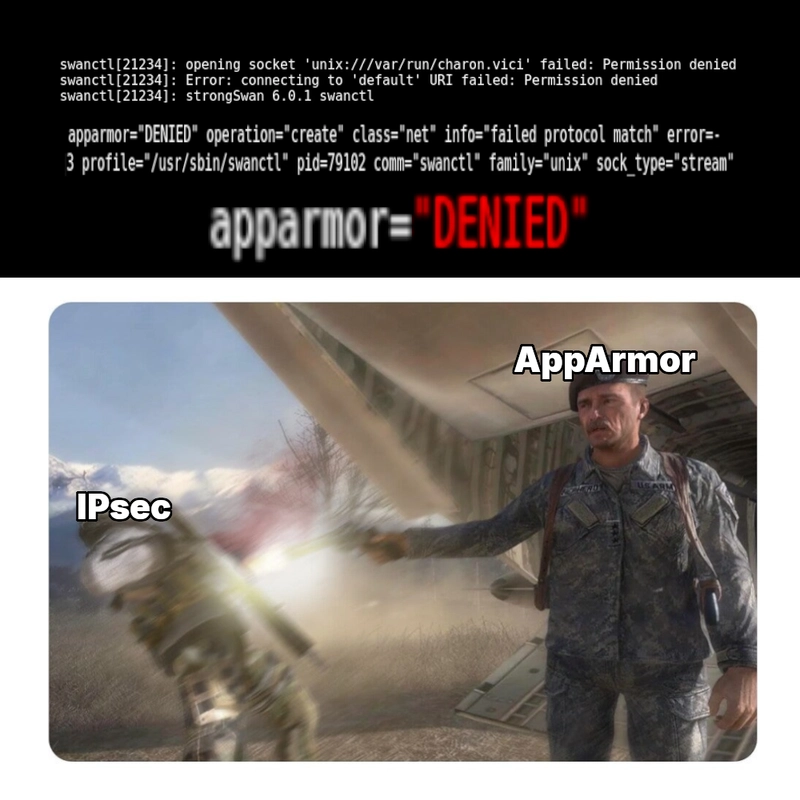

## The Problem

I'm working on setting up SDN zones and IPsec encryption for my Proxmox VE 9 machines. I followed the usual [guide](https://pve.proxmox.com/pve-docs/chapter-pvesdn.html) on creating and encrypting SDN zones, installed the usual stuff like `frr-pythontools` and `strongswan`, but then ran into this issue when using `swanctl` to check the status of strongSwan:

```shell
root@pve:/etc/apt/sources.list.d# swanctl --stats
plugin 'test-vectors': failed to load - test_vectors_plugin_create not found and no plugin file available
...
plugin 'curl': failed to load - curl_plugin_create not found and no plugin file available
opening socket 'unix:///var/run/charon.vici' failed: Permission denied
Error: connecting to 'default' URI failed: Permission denied
```

At first, I thought this was a simple permissions issue, but the strongSwan service should be running as the root user. I checked the permissions of the socket at `/var/run/charon.vici`.

```shell
root@pve:/etc/apt/sources.list.d# ls -la /var/run/charon.vici
srwxrwx--- 1 root root 0 Feb 28 10:39 /var/run/charon.vici
```

The root user should have permissions for it, but the logs said it doesn't have the permission. What is going on?
## Systemd Service Troubleshooting

My first instinct is to check the Systemd logs. `strongswan.service` is the service that manages IPsec, and it's the service that `swanctl` connects to.

```shell
root@pve:/etc/apt/sources.list.d# systemctl status strongswan
× strongswan.service - strongSwan IPsec IKEv1/IKEv2 daemon using swanctl
     Loaded: loaded (/usr/lib/systemd/system/strongswan.service; enabled; preset: enabled)
     Active: failed (Result: exit-code) since Sat 2026-02-28 10:39:09 HST; 3h 55min ago
	...
    Process: 21205 ExecStart=/usr/sbin/charon-systemd (code=exited, status=0/SUCCESS)
    Process: 21234 ExecStartPost=/usr/sbin/swanctl --load-all --noprompt (code=exited, status=13)
   Main PID: 21205 (code=exited, status=0/SUCCESS)
```

StrongSwan is inactive; that's obvious. But one thing that stands out is that the `charon-systemd`, the process in the `ExecStart` line, started up fine. However, the problem comes from `swanctl` that is activated in `ExecStartPost`. 

Let's look at the logs for `strongswan.service`.
```shell
root@pve:/etc/apparmor.d# journalctl -u strongswan.service 
Feb 28 10:39:09 pve systemd[1]: Starting strongswan.service - strongSwan IPsec IKEv1/IKEv2 daemon using swanctl...
Feb 28 10:39:09 pve charon-systemd[21205]: Starting charon-systemd IKE daemon (strongSwan 6.0.1, Linux 6.17.2-1-pve, x86_64)
...
Feb 28 10:39:09 pve charon-systemd[21205]: dropped capabilities, running as uid 0, gid 0
Feb 28 10:39:09 pve charon-systemd[21205]: spawning 16 worker threads
...
Feb 28 10:39:09 pve swanctl[21234]: opening socket 'unix:///var/run/charon.vici' failed: Permission denied
Feb 28 10:39:09 pve swanctl[21234]: Error: connecting to 'default' URI failed: Permission denied
...
```

We can see here that the main component of strongSwan, `charon-systemd`, starts perfectly fine. However, the process of loading the configuration files using `swanctl` is producing the same error, and this is error caused Systemd to label the `strongswan.service` as "failed" and stopping the service.

While I didn't find the cause of the issue in the logs, it helped me narrow the potential root cause to a single binary. And if I can fix this issue in `swanctl`, we can also fix `strongswan.service` failing as well.

## Temporary Solution From AppArmor Troubleshooting
The source of this idea eludes me, but I stumbled upon a forum post when troubleshooting this issue that pointed out that this might be an issue related to AppArmor, and recommends that I check the entire journalctl logs for AppArmor denials. So I ran `journalctl` and looked for any logs related to `swanctl` and found this:

```shell
pve kernel: audit: type=1400 audit(1772327420.130:165): apparmor="DENIED" operation="create" class="net" info="failed protocol match" error=-13 profile="/usr/sbin/swanctl" pid=64058 comm="swanctl" family="unix" sock_type="stream" protocol=0 requested="create" denied="create" addr=none
```

The log states that AppArmor prevented `swanctl` from performing a "create" operation on a Unix socket. Looks like this denial might be the reason for the `Permission denied` error, but let's confirm that this is really the issue.

I tested the hypothesis by turning the AppArmor profile of `swanctl` into complaint mode, which temporarily removes any restrictions on the process.
```shell

apt install apparmor-utils # Install packages that provide apparmor_parser
apparmor_parser -Cr usr.sbin.swanctl # Disables AppArmor enforcement
```

Let's run `strongswan.service` now.

```shell
root@pve:/etc/apparmor.d# systemctl start strongswan
root@pve:/etc/apparmor.d# systemctl status strongswan
● strongswan.service - strongSwan IPsec IKEv1/IKEv2 daemon using swanctl
     Loaded: loaded (/usr/lib/systemd/system/strongswan.service; enabled; preset: enabled)
     Active: active (running) since Sat 2026-02-28 15:27:15 HST; 8s ago
     ...
```

`strongswan.service` is running fine, but what about `swanctl`?

```shell
root@pve:/etc/apparmor.d# swanctl --stats
...
uptime: 3 seconds, since Feb 28 15:33:52 2026
worker threads: 16 total, 11 idle, working: 4/0/1/0
job queues: 0/0/0/0
jobs scheduled: 0
```

Yup, looks like AppArmor was the cause of this issue. The AppArmor denial is preventing `swanctl` from creating or accessing the `/var/run/charon.vici` socket, which also causes `strongswan.service` to fail. By **disabling AppArmor enforcement on `swanctl`**, we can fix the `Permission denied` issue.

However, this is not the perfect solution. While we can run strongSwan without AppArmor, it provides MAC (Mandatory Access Control) rules that can prevent attackers from exploiting zero-day vulnerabilities in the strongSwan process. 

StrongSwan is more secure with AppArmor enabled, and if I can find a way to run AppArmor without denying IPsec, I'd take it.

## Trying Custom AppArmor Rules
So, if AppArmor is causing deny issues, what if we create a rule to allow `swanctl` to access this socket? I found another [post](https://groups.google.com/g/linux.debian.bugs.dist/c/b6jFluenbpE) that has a potential solution. Essentially, the author modified `swanctl`'s AppArmor profile to explicitly allow the process to create and access any required Unix sockets.

Here's how I implemented the solution. I'm using VICI, strongswan's newer interface, so I add the following to `/etc/apparmor.d/usr.sbin.swanctl`:
```shell
unix (create) type=stream # Don't actually add this line. This is my own attempt at solving this issue.
```

I reloaded the profile.
```shell
apparmor_parser -r /etc/apparmor.d/usr.sbin.swanctl
```

Then I tried to start `strongswan.service` with the new profile.
```shell
root@pve:/etc/apparmor.d# systemctl start strongswan
Job for strongswan.service failed because the control process exited with error code.
...
root@pve:/etc/apparmor.d# journalctl -u strongswan
...
Feb 28 17:38:25 pve swanctl[87986]: opening socket 'unix:///var/run/charon.vici' failed: Permission denied
Feb 28 17:38:25 pve swanctl[87986]: Error: connecting to 'default' URI failed: Permission denied
```

Same error, no dice. However, this attempt did show me that the issue might not come from the profile itself, but something else related to AppArmor.
## The Real Root Cause And The Long-Term Solution
It had been a long couple of days of searching for the solution to this issue before I stumble upon the hidden gem in this [containerd repository issue](https://github.com/containerd/containerd/issues/12726). Basically, [Alex Chernyakhovsky](https://github.com/achernya) found that AppArmor changed its ABI recently and broke the Unix socket networking options in AppArmor profiles. We have to wait until the upstream developers fix this issue, but something we can do now is to **configure AppArmor to use the previous ABI version**.

Open `/etc/apparmor/parser.conf` and add this line:
```
# Force pre-kernel 6.17 ABI
override-policy-abi=/etc/apparmor.d/abi/4.0
```

Now we can reapply `swanctl`'s profile. In my experience, I needed to clear the cache first using thr `--purge-cache` option before loading the new profile.
```shell
apparmor_parser --purge-cache
apparmor_parser -r /etc/apparmor.d/usr.sbin.swanctl
```

Here's my result after applying this fix:


It's working but only after still saying `Permission denied` at first. I'm not sure why this is happening, but in my experience, refreshing the AppArmor service and its policies a couple of times should make it read the new settings properly. It's fiddly like that.

This is only a stopgap solution until the upstream developers fix this issue, but compared to not having the AppArmor protection on the process, it's a sufficient solution for now.

### Note: Vici vs Stroke
I ran into this `Permission denied` issue as well when using the older Stroke version of strongSwan. Forcing AppArmor to use the older ABI should work with either version.

## So, does it work in the end?
To verify that strongSwan is working properly and can establish security associations between my two Proxmox nodes, I deployed a simple test setup.

I clustered two Proxmox nodes and created a simple VXLAN SDN zone:


In both nodes, I set up a simple configuration for strongSwan in `/etc/swanctl/swanctl.con`:
```
connections {
  vxlan {
    proposals = aes128-sha256-modp3072
    remote_addrs = 10.0.0.65 # Set to the other node's IP
    encap = yes
    local {
      auth = psk
    }
    remote {
      auth = psk
    }
    children {
      net-net {
        esp_proposals = aes128-sha256
        remote_ts = 0.0.0.0/0[udp/4789]
        local_ts = 0.0.0.0/0[udp/4789]
        mode = transport
        start_action = start
        updown = /usr/lib/ipsec/_updown iptables
      }
    }
  }
}

secrets {
  ike {
    secret = SECRET
  }
}
```

After applying it via `swanctl --load-all`, here is the result when running `swanctl --list-sas`:


StronSwan can now establish IPsec connections between the two nodes without AppArmor denials, and I can keep working on the IPsec configuration further to secure the VXLAN communications.
## TLDR
### Why is this happening?
AppArmor ABI broke some Unix networking options.

### How do you fix this?
Switch to the older ABI:
```shell
echo override-policy-abi=/etc/apparmor.d/abi/4.0 | tee -a /etc/apparmor/parser.conf

systemctl restart apparmor.service # (optional) This is to make sure AppArmor is reloaded properly
apparmor_parser --purge-cache # Needed on my end because my setup won't refresh swanctl's profile
apparmor_parser -r /etc/apparmor.d/usr.sbin.swanctl
```

### Thoughts? Comments? Questions?
Feel free to leave a comment on [dev.to](https://dev.to/patimapoochai/how-to-fix-the-opening-socket-charonvici-failed-permission-denied-issue-in-proxmox-cd4).


