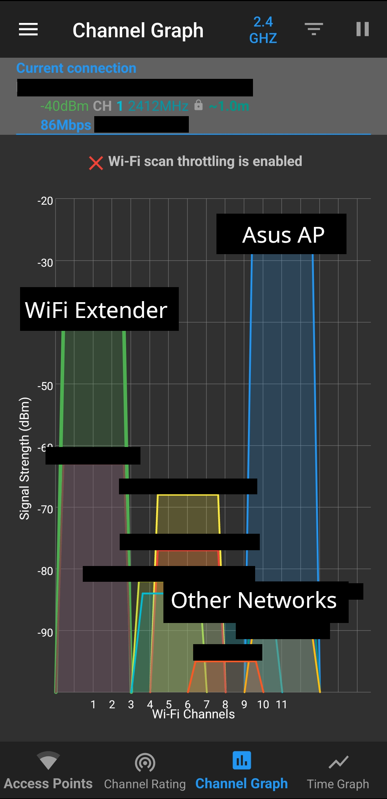

In this blog, I will show you how I set up my home lab network without a direct ethernet port (also known as a [network drop](https://networkencyclopedia.com/drop/)). I used a WiFi range extender as a bridge to a SOHO (small office home office) family router that converts WiFi signals into an ethernet port output. I then connect the WiFi extender to an OPNsense router to provide internet access to the devices without WiFi capabilities while also routing the traffic within the network using a dedicated, wired connection. I also connected another SOHO router to the OPNsense router as an AP (access point) to connect wireless devices to the network.

## What scenarios would be best suited for this setup?
This setup is great for scenarios where you don't have a direct ethernet connection between your router and your home lab, and you can't install new network drops to connect them. In my case, my house has a SOHO gateway router that is installed several rooms away from my home lab, and I can't make modifications to my living space, like drilling into the ceiling or through a wall, to run an ethernet cable to my setup. Other cases that would benefit from this setup are when you're renting, dorming, or living in a place that restricts modifications to the plenum space or the structure of the space to install new ethernet ports.

As the demarcation point for my house is located near the front of the building, the SOHO router that provides the WiFi connection for my household is very far from where my devices are located, and the only way I could get a wired connection between them is by running the cable through the ceiling.

## Why I chose to set up another router
While I can still run my home lab devices off of the SOHO router, there are a few reasons why I wanted a better setup:
- **Some home lab devices don't have a good WiFi antenna** - Some of my devices don't have a powerful enough WiFi card, and as my router is very far away, they can't get a stable network connection. Some home lab equipment that I plan to install in the future doesn't even have WiFi capabilities (like the [AML-S905X-CC](https://libre.computer/products/aml-s905x-cc/)).
- **Network-heavy tasks will flood the WiFi network** - Some of my services generate a large amount of network traffic, and it can create congestion on the WiFi network and slow down the internet connection. Since the SOHO router is used by everyone in my family, I can't have my network-heavy tasks running on it. The limited bandwidth of WiFi can also create a bottleneck for high-bandwidth network tasks like NAS (Network Attached Storage) servers and media streaming services.

I wanted to set up a dedicated WiFi extender that consolidates many weak WiFi signals into a single, high-performance connection to my router. I also wanted to keep network-heavy traffic off of the WiFi network and route them via a wired connection instead. By creating a setup to convert the WiFi signals into ethernet, I can get the benefit of having a wired connection for my home lab without spending money and time to set up a direct physical connection to my router.

If you want a stable, wired connection for your home lab devices, you can follow along with the steps I took to implement this setup below.
## Setup the physical devices
### Gear list
These are the devices I used for this setup:
#### WiFi range extender: **TP-Link re220**

#### Router computer: **Zimaboard**

#### Switch: **TP-Link TL-SG108E managed switch**

You don't have to specifically use these devices. You can use anything that's the best fit for your use case, as long as they have the necessary features. For the WiFi extender, the key feature you're looking for is that the device has an ethernet port output. For the router computer, you're looking for a device that is compatible with your desired router OS and has two ethernet ports. The switch doesn't even have to be managed, I went with the TL-SG108E switch because I want to configure VLANs and other network configurations in the future.

### Setup the WiFi extender

The first step is to set up the WiFi extender to connect it to the SOHO router over WiFi. The individual steps to do so can vary depending on the device you use, so it's best that you follow your device's instructions or manual.

In my case, I connect my laptop to the WiFi extender via its ethernet port to access the device's web interface. Then, I entered the SSID of my home network and its WiFi password, and the extender can use this information to connect to the SOHO router's WiFi network.

You should know when the WiFi extender is connected when you connect a computer to the extender's ethernet port, you are able to get internet access from your device. I just ran a quick `ping` command and I was able to get replies back.

After setting up your WiFi extender, here is how your network should look like:

### Set up the router and the switch
Here is how I set up the other devices:

There are a few key points to this configuration:
- The ethernet cable that is coming from the WiFi extender should be plugged into the WAN port of your router. In my case, the OPNsense router can use any port as the WAN interface, so I plugged it into the `re0` interface.
- Then, you can connect the other interface (`re1`) on your router to the switch. The router will provide internet access and LAN routing via the switch, so you can connect any home lab devices you have to the remaining ports of the switch.
- Lastly, you should place your WiFi extender as close to your home router as possible and point it in the SOHO router's direction. This will ensure that you get the best possible connection between your home router and your home lab network. For my setup, I mounted my WiFi extender on a gooseneck holder, and I pointed it in the direction of the SOHO router.

## Configure the networking layer
### The general steps
I went with OPNsense as the router operating system for this project, but if you don't want to use OPNsense, you can still follow along with this setup. The workflow might be different, but the general step of how you should configure the router should be the same:   
1. Set the interface connected to the WiFi extender as the WAN interface
2. Set the interface connected to the switch as the LAN interface
3. Make sure a DHCP server is active on the LAN interface

### Configure OPNsense
#### 1. Install and start OPNsense according to the [documentation](https://docs.opnsense.org/manual/install.html)
In short, you would flash the installation image onto a USB drive, boot from the USB drive, log into the installation account, and follow the installation wizard.

#### 2. Take note of which interface is connected to the WiFi extender and which is connected to the switch
If you recall the physical devices I set up earlier, I connected the WiFi extender to `re0` and the switch to `re1`.

#### 3. Assign the WAN interface to the port connected to the WiFi extender (`re0`) and set the IP address of the WAN interface to DHCP
This will make the OPNsense router take whatever IP the SOHO router assigns to it.

#### 4. Assign the LAN interface to the port connected to your switch and use a static IP address for the LAN interface
In OPNsense, setting the static IP address of the LAN interface will also affect the network address you can use for your network. That means you should set the LAN interface's IP to the first, non-network address of your desired CIDR (Classless Inter-Domain Routing) range.

For example, I want my home lab network to have a CIDR range of 10.0.0.0/24, so I would set the static IP address off the LAN interface in OPNsense to be 10.0.0.1.

You should also make sure that the IP range on the LAN interface doesn't overlap with the IP range of your SOHO network, as setting them to overlap will cause routing issues on your home lab network. For example, if my SOHO router uses 192.168.1.0/24, I cannot set my home lab router to use 192.168.1.0/24 as well. However, 192.168.2.0/24 will not overlap with the SOHO router.

#### 5. Set up a DHCP server that will run on the LAN interface.
In OPNsense, you set the lower and upper bound of the IP assignment range. Since my network address is 10.0.0.0/24, the valid client address range would be between 10.0.0.2 and 10.0.0.254.

After assigning interfaces and setting up the DHCP server, the WAN interface of the OPNsense router will be assigned an IP address within the SOHO router's WiFi network; making the router appear as just another device on the WiFi. However, the OPNsense router will also serve as the internet gateway for your home lab devices that are wired to the switch. The traffic within the 10.0.0.0/24 network will only pass through the switch, while the internet-bound traffic will be forwarded to the OPNsense router, which will also forward said traffic to your SOHO router over the WiFi connection.

## Setup an access point with another SOHO router
We have set up the home lab network to forward wired traffic to the SOHO router over WiFi, but wireless devices cannot connect to the home lab network as is, as the OPNsense doesn't have a WiFi card. We can fix this issue by adding an AP device that is plugged into the switch. It will forward the traffic from your wireless device to the OPNsense router over WiFi, serving as the bridge between your wireless devices and your wired home lab devices.

Like before, you can use any AP device as long as it has an ethernet port. In my case, I already have a used ASUS RT-AC68U SOHO router. 

I simply connect an ethernet cable from the switch to the WAN port of the ASUS router. The router detects that it's on a network that's already managed by another router, and automatically switches to AP mode. This mode will make the ASUS router act as an AP, meaning that it will only forward requests between the wireless device and your home lab router without creating its own network. If your device doesn't automatically switch into AP mode, you can manually set the router to use this mode using its management UI.

The network should now look like this:

### WiFi channels overlapping issue
There might be an issue from the close proximity between the WiFi extender and your AP, as the WiFi signal emitted by both devices can overlap with each other, causing signal collisions and slowing down the connection speed in your network.

I fixed this issue by setting the AP to use a different WiFi channel frequency than the WiFi extender. WiFi devices can receive and transmit signals within certain ranges of channels, and you can prevent signal collisions by setting each device to use a non-overlapping channel.

Using [WiFiAnalyzer from F-droid](https://f-droid.org/packages/com.vrem.wifianalyzer/), I saw that the WiFi extender is using channels 34-50 on 5GHZ frequency and channels 1-3 on 2.4GHZ frequency. If my AP also uses the same range of channels, it would have to compete with the signals from the WiFi extender and slow down the network.

From the WiFi Analyzer, it seems like channels 163-167 on 5GHZ and channels 9-11 on 2.4GHZ are the least saturated, so I set the AP to use those channels on 5GHZ and 2.4GHZ. 

With this change, both devices should be using different channels, allowing them to work in harmony despite the close proximity.

## Conclusion
### Takeaways
By adding a few pieces of networking equipment, you can get an internet connection over WiFi while still providing a wired connection between devices and keeping network-heavy traffic off of the air.

You can connect a WiFi extender to the SOHO network, and convert that WiFi signal into an ethernet port output. With this port, we can then set up a home lab network with OPNsense that provides a fast wired connection between devices in your home lab network.

If you need to connect wireless devices to your home lab network, you can set up an AP that forwards the traffic to your switch. We can then minimize the disruption from the close proximity between the AP and the WiFi extender by configuring both devices to use different WiFi channels.

### Result
After finishing this setup, here is how the internet speed would look like on a device using the SOHO WiFi:

78 Mbps, pretty good.

Here is my internet speed using the wired connection:

73.92 Mbps on the wire. While it is slower than just using the SOHO router's WiFi directly, all of the internal traffic between home lab devices is kept off of the WiFi, so I'm content with ~5 Mbps drop in speed.

Here is my internet speed from my wireless device connected to the AP:

54 MB on wireless devices going through the AP. The speed drop and increased latency make sense here, as I'm using an older router and each packet has to hop across two different WiFi connections and three extra network devices.

### See some improvements?
If you tried this setup, feel free to let me know what your result is. I'm only getting started with the home lab hobby, so if you have any suggestions for improvements, I'd appreciate any feedback in the comment on [dev.to](https://dev.to/patimapoochai/how-to-run-a-home-lab-without-an-ethernet-port-220j).
