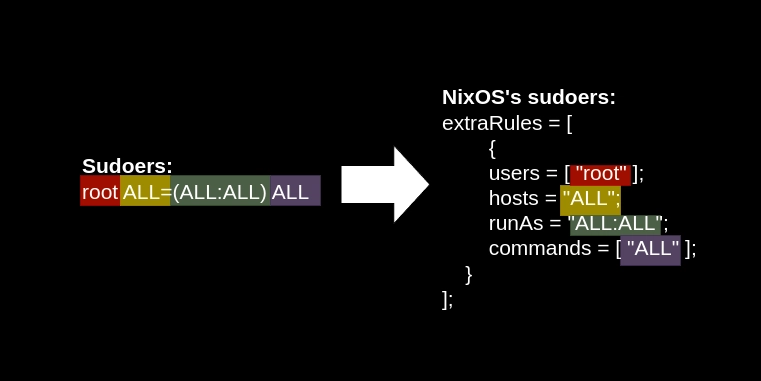

## Intro
I wanted to configure the `/etc/sudoers` file in NixOS to setup an account that doesn't require password with sudo for Ansible management. However, the [wiki page for sudo](https://wiki.nixos.org/wiki/Sudo) is a bit lacking, so here's everything I know about managing the sudoers file from trial and error and reading other sources.

## Basics
If you don't know how to edit the sudo files normally, I recommend you read [DigitalOcean's guide](https://www.digitalocean.com/community/tutorials/how-to-edit-the-sudoers-file) first.

### Boilerplate
Here is how you would write the boilerplate to manage the sudoers file. You should put these lines in your `configuration.nix` file or in a Nix module that is imported into `configuration.nix`.
```nix
{ config, pkgs, ... }:

{
	security.sudo = {
    	# place top level options (like wheelNeedPassword) here
    	enable = true; # make sure to enable the sudo package
        execWheelOnly = false;
        wheelNeedsPassword = false;

        extraConfig = "#includedir /etc/sudoers.d"; # write custom config in here

        extraRules = [
        	# place sudoers rules here
        ];
    };

    # place other configurations outside of the sudo package here
}
```

Key points:
- You manage sudoers by setting the configurations inside the `security.sudo` module.
- You put all of the sudoers rule in the `extraRules` property (there is no defaultRules property).
- You can set other options, like disabling the password prompt for the wheel group, outside of the `extraRules` property.
- You can view all possible options for the modules using the man page by running `man configuration.nix` and searching for `security.sudo`. You can also view the man page online on [mankier.com](https://www.mankier.com/5/configuration.nix).

### extraRules Template
Here is a template of how you'd write a sudoers rule inside the `extraRules` property.
```nix
extraRules = [
	{
		users = [ "sudoers-example" ]; # apply this rule to this user
        # groups = [ "wheel" ]; # replace the line above with this line to apply the rule to groups
        hosts = "ALL"; # host portion of ALL=(ALL:ALL) (i.e. the "ALL=" part), optional
        runAs = "ALL:ALL"; # the "(ALL:ALL)" part in ALL=(ALL:ALL), optional
        
        commands = [ # takes in a list of commands
          "/run/wrappers/bin/passwd" # you can write the commands as only a string

          # or write more complex commands uses an attribute set
          {
            command = "ALL"; # this would be NOPASSWD: ALL
            options = [ "NOPASSWD" ]; # don't need the ":" at the end
          } 
		];
	} 
];
```

### Translating from normal configuration to NixOS sudoers
Here is how the normal sudoers rules can be translated into the NixOS configuration.



A few things to note:
- The `users` field accepts a list of usernames as strings.
- The `commands` field also accepts a list of commands as strings, and it will transform the list into a single line delimited by commas.
- The `runAs` field doesn't require a parentheses.

### Applying the configuration
After writing the NixOS configuration, there are two ways to apply it:
- Apply the sudo rules to the system temporarily
```bash
nixos-rebuild test
```
- Permanently apply the sudo rules to the system
```bash
nixos-rebuild switch
```

You could then test your configuration with these commands
- Change into user account
```bash
sudo su - USERNAME
```
- List the permissions that are assigned to the user with
```bash
sudo -l
```

## Common tasks with examples
Here are some common sudoers configurations and how you can write them in NixOS.

### Make a user become a member of the group wheel (fastest way to give privilege)
First create the `sudoers-example` user, equivalent to `usermod -aG wheel user`.
```nix
{ config, pkgs, ...}:

{
  users.users.sudoers-example = {
    isNormalUser = true;
    createHome = true;
    extraGroups = [ "wheel" ]; # add into wheel
  };
  ...
}
```
Then add the wheel group and give it root privileges, equivalent to `%wheel ALL=(ALL) ALL`.
```nix
{
	...
	security.sudo = {
    	enable = true;
        
        extraRules = [
            {
                groups = [ "wheel" ];
                commands = [ "ALL" ];
        	}
        ];
}
```
If you don't add `hosts = "ALL"` and `runAs = "ALL:ALL";`, NixOS will set the `hosts` and `runAs` to `ALL=(ALL:ALL)` by default.

### Fastest way to make the wheel group not prompt for a password
The fastest way to make the sudo command work without a password is to assign the user to the `wheel` group and set the `security.sudo.wheelNeedsPassword` property to true. I found this property from the [NixOS forum](https://discourse.nixos.org/t/dont-prompt-a-user-for-the-sudo-password/9163).
```nix
security.sudo = {
	# remember the top level options?
	wheelNeedsPassword = false;
}
```

### Short configuration to allow a user to run all commands as root
Equivalent to `sudoers-example ALL=(ALL:ALL) ALL`.
```nix
extraRules = [
	{
    	users = [ "sudoers-example" ];
        commands = [ "ALL" ];
    }
];
```

### Allow users in certain groups to run all commands as root
This is similar to the above rule, but swap the `users` property with the group you want and the commands to what you want. Equivalent to `%administrator ALL=(ALL:ALL) ALL`.
```nix
extraRules = [
    {
        groups = [ "administrator" ];
        commands = [ "ALL" ];
	}
];
```

### Allow a user to use sudo for a specific list of commands
Equivalent to `sudoers-example ALL=/usr/bin/useradd, / usr/bin/passwd`.

Caveats:
- You cannot use the normal Linux path for commands, like `/usr/bin/useradd` for `useradd`.
- This is because NixOS stores the packages in an alternate location, called the Nix store. You have to use the package's path from said store, and you can't use the usual path, like `/usr/bin/passwd`. A quick and dirty workaround for me is to just run `which COMMAND` first to get the package's path for NixOS.
```bash
[root@nixos:/etc/nixos]# which passwd
/run/wrappers/bin/passwd
```
```nix
extraRules = [
      {   
        users = [ "sudoers-example" ];
        commands = [ 
          {   
            command = "/run/current-system/sw/bin/useradd";
          }   
          {   
            command = "/run/wrappers/bin/passwd";
          }   
        ];  
      }
];
```

### Exclude specific commands
This configuration allow the user to change the passwords for all users, but restrict it from changing the root user's password, equivalent to `sudoers-example ALL=/usr/bin/passwd, ! /usr/bin/passwd root`. Remember to run `which COMMAND` first to find the path of the command.
```nix
extraRules = [
      {   
        users = [ "sudoers-example" ];
        commands = [ 
          {   
            command = "/run/wrappers/bin/passwd"; # you can run passwd on any user
          }   
          {   
            command = "! /run/wrappers/bin/passwd root"; # but can't run passwd on root
          }   
        ];  
      }
];
```


### Allow a user to run all commands without a password
Equivalent to `sudoers-example ALL=(ALL:ALL) NOPASSWD: ALL`. Notice how the tag_spec name (`NOPASSWD`) doesn't require an `:` at the end.
```nix
extraRules = [
    {   
        users = [ "sudoers-example" ]; 
        commands = [ 
          {   
            command = "ALL";
            options = [ "NOPASSWD" ]; # don't need the ":" at the end 
          }   
        ];  
    }
];
```

### Require a password for all commands, but no password for certain commands
Equivalent to `sudoers-example ALL=(ALL:ALL) PASSWD: ALL, NOPASSWD: /usr/sbin/modprobe`. The user can need to enter their password for all commands except `modprobe`.
```nix
extraRules = [
    {   
        users = [ "sudoers-example" ]; # applies the first column of the sudoers line
        commands = [ 
          {   
            command = "ALL";
            options = [ "PASSWD" ];
          }   
          {   
            command = "/run/current-system/sw/bin/modprobe"; # allow loading and unloading of kernel modules
            options = [ "NOPASSWD" ];
          }   
        ];  
    }
];
```

### Prevent commands from spawning subcommands
You can bypass sudo's authorization process by running an allowed command, then triggering the command to spawn a subcommand with the root privileges that was previously blocked by sudo. From the [DigitalOcean article](https://www.digitalocean.com/community/tutorials/how-to-edit-the-sudoers-file), for example, you can run `less` with sudo but also spawn a bash shell within it that has root privileges.

You can prevent users from spawning subcommands using the `NOEXEC` tag_spec in sudo.
```nix
extraRules = [
    {   
        users = [ "sudoers-example" ];
        commands = [ 
          {   
            command = "/run/current-system/sw/bin/less";
            options = [ "NOEXEC" ]; # apply a tag_spec that prevent spawning child processes
          }   
        ];  
    }
];
```
Now you can't execute other commands in `less` by typing `! COMMAND`

### Create sudoers aliases for user groups, commands, and run-as
Aliases are a feature of sudo that's similar to a local variable; a single name that refers to a list of items. There's no property in NixOS that can specifically set the `User_Alias`, `Cmnd_Alias`, `Runas_Alias` aliases, but you can use the `extraConfig` property to set aliases with custom texts. NixOS will then append the lines from the property into the sudoers file.
```nix
security.sudo = {
	enable = true;

	extraConfig =
    ''  
    User_Alias    ADMINGROUP = sudoers-example # define aliasses here
    '';

    extraRules = [ 
      {   
        users = [ "ADMINGROUP" ]; # will resolve to sudoers-example
        commands = [ "ALL" ];
      }
    ];
}
```
Other aliases should work too.
```nix
	extraConfig =
    ''  
    User_Alias    GROUP = user1, user2
    Cmnd_Alias    KERNEL = /run/current-system/sw/bin/modprobe, /run/current-system/sw/bin/modinfo
    Runas_Alias	  VIRT = kvm
    '';
```

### Set other settings of the sudoers file
If you want to add custom configurations that aren't implemented in NixOS's sudo module, you can also use the `extraConfig` property. For example, if you want to add `/etc/sudoers.d` as a drop-in configuration directory where sudo will search for extra configurations files, then you can add a multi-line string in the format of the normal sudoers configuration language to the `extraConfig` property.
```nix
security.sudo = {
	extraConfig =
    ''  
    #includedir /etc/sudoers.d
    '';
}
```

## Closing Thoughts
Configuring sudo in NixOS might be confusing at first, but you can master the process easily if you practice writing a few sudoers rules and reference the man page of the `configuration.nix` file by running `man configuration.nix`. 

Going back to the purpose of this blog post, we can now write the `configuration.nix` file to create a user called `ansible` and allow this user to use sudo without asking for the password like so:
```nix
{ config, pkgs, ... }:

{
  # create "ansible" user
  users.users.ansible = {
    isNormalUser = true;
    home = "/home/ansible";
    openssh.authorizedKeys.keys = ["ssh-rsa PUBLICKEY"];
  };

  # set up sudo to not ask for a password
  security.sudo = { 
    enable = true;
    extraRules = [ 
      {   
        users = [ "ansible" ];
        commands = [ 
          {   
            command = "ALL";
            options = [ "NOPASSWD" ];
          }
        ];
      }
    ];
  };
  
}
```