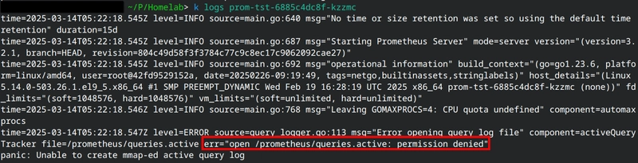

I learned how to diagnose a new Prometheus + Kubernetes issue today, here's a summary of what I did.

## Context
I'm trying to install the Prometheus monitoring tool to my k3s cluster using a Helm chart, and I want to store the metrics data in a volume that is mounted to the `/prometheus` directory inside the container. I created a volume that is mounted locally to the `/home/ansible/prometheus/data` directory on host machine using the `rancher.io/local-path` storage class.

The PersistentVolume and Deployment manifest would look something like this:
```yaml
apiVersion: v1
kind: PersistentVolume
spec:
	storageClassName: local-path
 	local:
   		path: /home/ansible/prometheus/data # directory that is mounted on the host
...
```

```yaml
apiVersion: apps/v1
kind: Deployment
...
  template:
    spec:
      containers:
      - image: {{ .Values.image.repository }}/prometheus:{{ .Chart.AppVersion }}
        volumeMounts:
        - mountPath: /prometheus # the volume will be mounted here in the container
          name: prometheus-pvc
...
```

These manifests createe a volume that stores the data on the host computer running k3s, and mount that volume to the `/prometheus` path inside the container.

## The Problem
The Helm chart installed without an issue, but I get this error when checking the status of the Prometheus pod:
```bash
NAME                        READY   STATUS             RESTARTS       AGE\
heimdall-788f5f64c8-mh2lb   1/1     Running            1 (4d4h ago)   4d4h\
prom-tst-6885c4dc8f-kzzmc   0/1     CrashLoopBackOff   4 (56s ago)    2m19s
```

I looked at the logs of the pod:



What caused the pod to be in the CrashLoopBackOff state was the error: `open /prometheus/queries.active: permission denied`.

Seems like Prometheus couldn't create the necessary files inside the `/prometheus` directory inside the container due to it lacking the necessary permissions. It reminded me of a section from an RHCSA book that explained how you can't bind mount a directory inside the container to a directory on the host if it doesn't have the correct permissions and the correct UID for the user inside the container. Since Prometheus' volume is mounted locally to the host machine, this section of the book might have something to do with why Prometheus is getting this error.

The book recommended that I run `podman unshare` to show the UID of the user inside the container, and set the owner of the directory on the host to have the same UID, but I don't know the equivalent command in Docker to get the container user's UID.

I tried looking through Prometheus' [Dockerfile on Github](https://github.com/prometheus/prometheus/blob/b0227d1f16ea5da448f7a610ed9a7e22e6f35782/Dockerfile#L17) to see if I can find the UID of the container user somewhere, but I found something else instead:


Looks like the user account of the container is set to `nobody`, and it sets the `/prometheus` directory inside the container to be owned by `nobody`. Maybe the container still expects that directory to still be owned by `nobody` when its being used, but who is the owner of that directory on the host machine now?

```bash
[ansible@nextcloud prometheus]$ ls -la
total 4
drwxr-xr-x.  3 ansible ansible   18 Mar 13 19:08 .
drwx------. 13 ansible ansible 4096 Mar 13 19:08 ..
drwxr-xr-x.  4 ansible ansible   70 Mar 13 19:15 data

```

Inside the `/home/ansible/prometheus` directory, the `data` directory is owned by the user `ansible`. Just a hunch, but I can try changing the directory owner and group owner on the host machine to be `nobody`, and remove the failing pod.
```bash
[ansible@nextcloud prometheus]$ sudo chown -R nobody:nobody data
[ansible@nextcloud prometheus]$ ls -la
total 4
drwxr-xr-x.  3 ansible ansible   18 Mar 13 19:08 .
drwx------. 13 ansible ansible 4096 Mar 13 19:08 ..
drwxr-xr-x.  4 nobody  nobody    70 Mar 13 19:15 data
[ansible@nextcloud prometheus]$
```
```bash
localhost@computer ~/P/Homelab> k get po
NAME                        READY   STATUS             RESTARTS        AGE
heimdall-788f5f64c8-mh2lb   1/1     Running            1 (4d4h ago)    4d4h
prom-tst-6885c4dc8f-kzzmc   0/1     CrashLoopBackOff   8 (4m28s ago)   20m
localhost@computer ~/P/Homelab> k delete po prom-tst-6885c4dc8f-kzzmc  
pod "prom-tst-6885c4dc8f-kzzmc" deleted
```

And voila, that configuration seems to be what Prometheus needed:
```bash
localstoat@thinkpad-e495 ~/P/Homelab> k get po
NAME                        READY   STATUS    RESTARTS       AGE
heimdall-788f5f64c8-mh2lb   1/1     Running   1 (4d4h ago)   4d4h
prom-tst-6885c4dc8f-hghv7   1/1     Running   0              68s
```

And Prometheus is now accessible by accessing the FQDN of the host on the NodePort of the service:


## Key takeaways
- If you're getting a `permission denied` on a Kubernetes deployment that is using a local-path storage class, you have to make sure that **the owner of the directory that is used by the PersistentVolume should be the same as the user inside the container**, as well as having the necessary permissions. Otherwise, you'll see Prometheus is getting a `permission denied` error while trying to write to that directory.
- `rancher.io/local-path` is really just using directory bind mount under the hood, and the best practices from Linux administration to make the host machine work correctly with bind mounts can still be applied in Kubernetes.
- You can look inside the service's Dockerfile to get information about the user and directory permissions of the container.

## Extra: codifying this troubleshooting into configuration management
To make this whole troubleshooting journey worth it, I modified my Ansible playbook that is used to deploy the Prometheus Helm chart to automatically set the directory owner to be `nobody`. If I have to reinstall the Prometheus Helm chart again, my configuration management tool will apply this fix automatically without manual intervention:

```yaml
- name: Setup prometheus with helm
 hosts: rocky,&prometheus
 tasks:
 - name: add directory for bind mount volumes
   file:
     path: /home/ansible/prometheus/data
     owner: nobody # added to set directory owner to be the "nobody" account
     group: nobody # added to set group owner to be the "nobody" account
     state: directory
```

## TLDR
### What caused this
- The directory used by the PersistentVolume of "rancher.io/local-path" storage class doesn't have the same owner as the user in the Prometheus container.

### Why
- The user in the container is restricted from reading and writing files in the directory on the host machine that stores the data for the local-path volume.

### How to fix it
- Run a `chmod` on the host machine to change the user of the directory to be whatever the user inside the container is, in this case it's "nobody".
```bash
sudo chmod -R <DirectoryOfTheVolume>
```
- Delete the failing pod (and recreate it if you're not using a Deployment)
```bash
kubectl delete pod <PodName>
```