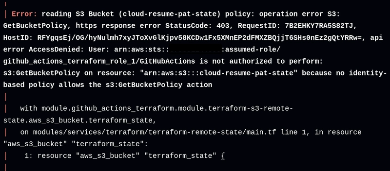

I've recently completed the [Cloud Resume Challenge](https://cloudresumechallenge.dev/docs/the-challenge/aws/) created by Forrest Brazeal. The challenge involves building a resume website using modern cloud technologies by completing a set of challenges called "Chunks". For my version, I created a static resume site in NextJS that is hosted on S3 and Cloudfront with a user count tracking feature that is implemented with Lambda and DynamoDB. I also applied modern DevOps principles by deploying the infrastructure as code with Terraform, creating a CI/CD pipeline using GitHub Actions, and performing end-to-end testing with Cypress. Working through this challenge felt like a breath of fresh air. While I’ve worked on many web projects throughout my college years, I haven’t gained as much insight and new perspectives on software development as I did from working through this challenge.

## Chunk 1: The Front End
The Cloud Resume Challenge is divided into four chunks, with each chunk containing a set of steps to build each component of the project. I started with the first chunk by building the front end of the resume website which consists of a website built with NextJS. The challenge only requires a basic HTML/CSS website, but I chose to use NextJS because, having worked with web projects in the past, a pure HTML/CSS website will be more difficult to maintain in the future than a production-grade platform like NextJS. I also decided on this framework because of its flexibility in creating both server-sided and static websites, and I wanted to gain experience with this framework for future projects. I also chose to implement the frontend components as Infrastructure as Code (IaC) earlier than required using Terraform. This decision made the learning process for this tool easier as it allowed me to write IaC code on a simpler architecture, and it would save me time when I had to convert the entire project to IaC later on.

Then, I deployed the site to AWS using an S3 bucket and cache the website on the Cloudfront CDN service. I also secured the web requests sent to the website by implementing HTTPS using AWS Certificate Manager. So far this is nothing too different from my past projects, but as I moved on to the next chunks, my past experience would become less and less useful.

## Chunk 2: The Back End 
The main feature of chunks 2 and 3 is the visitor count. The challenge required a persistent counter to show the number of visitors that viewed the page and update the number each time the user refreshes the page. I began working on the backend of this feature in chunk 2 by writing a Lambda function in Python that stores and updates the user count as a statistic record in the DynamoDB database each time a visitor views the site. The Lambda function is activated by making HTTP POST calls to a public AWS API gateway service.

I also added the extra functionality of a counter that displays the number of unique visitors to the site. A flaw with the regular visitor counter is that it counts up when the page is refreshed, and a user can inflate the number by refreshing the page multiple times. I created another counter that keeps track of the number of unique visitors by caching the IP address of each visitor and only counting the user as unique if their IP address is not contained in the cache. I also maintain the anonymity of each visitor by storing their IP addresses as hashes in the database. This extra interactivity can make the visitors feel more welcomed by having the website accurately recall the visitor’s interaction with the website.

## Chunk 3: Integrating Both Ends 
While the backend infrastructure of the visitor count was completed in the previous chunk, I still needed to make sure the website retrieves the data from the backend. My work in Chunk 3 was centered around making the counter that shows the correct number of visitors on the website and writing smoke tests for both the front end and the back end. I made the website query the API gateway for visitor count data by using Javascript code to make HTTP POST requests to the API gateway endpoints.

However, new challenges began to arise when I had to write code tests for the website. In my past college projects, quality isn't as important as submitting the project. As long as they are done enough and are submitted on time, the project would be considered “completed” even if the project has a high chance of being non-functional. With this focus on getting things out of the door rather than functionality, I’ve never considered writing tests for my projects. I've always had to manually test functionality by hand, leading to me implementing incomplete and broken features that require more patches in the future. In the worst case, the patches, due to the use of manual testing, would also introduce more issues in the code that require even more patches down the road. Having worked on many projects where quality doesn’t matter, I assumed that testing to be a waste of time, and time could be better spent on troubleshooting the issues when they appear.

My mindset began to change when chunk 3 required that I write tests for the API gateway. The challenge calls for the implementation of "smoke tests," end-to-end tests that measure the full functionality of the website, in Cypress. I had to think about what could go wrong in my code, like considering how an HTTP request could contain malformed headers or what can happen when the Lambda code increments the visitor count without initializing the database.

Thinking about the potential issues and writing tests to detect them made me realize the benefit of testing. A testing framework like Cypress ensures that each test runs consistently and correctly, while also providing the ability to quickly run all of the tests in a single click. The framework offloads the toil and prevents the errors of manual testing, giving me more time to work on the features of the website. Writing tests that ensure the website is functioning properly became as important as writing the code for the website itself. The focus changed from just "getting it done", to using tools that empower me to create quality work while also making it easy to do so.

During this chunk, I've also completed the task of earning an AWS certification. The original challenge required that I acquire the AWS Certified Cloud Practitioner certificate, but I already have that certificate. To further my learning, I've decided to obtain the associate-level AWS Certified Solutions Architect certificate. In hindsight, it was a good decision to get this certificate because I learned how the AWS services work and how they integrate together in more depth than the practitioner-level certificate.

## Chunk 4: The Last Stretch 
On the last stretch of the challenge, I migrate the remaining backend infrastructure to IaC with Terraform. I also created a CI/CD pipeline using GitHub Actions to manage the code hosted on a GitHub repository. GitHub Actions would deploy the code to AWS and run the end-to-end tests automatically when new code is committed to either of the repositories. This tool has solved another common issue I’ve had with my project in the past as well, where each project always had a major pain point where it would take a long time to troubleshoot issues when people commit broken code into the repository. Without automatic testing, there was a lot of work to identify what was broken and track down which commit caused the issue. There were even times when people would submit more commits with broken code while I was still troubleshooting the initial issue. If I had this CI/CD system that would have automatically checked the code of each commit and identified the commit with broken code at the time, it would have saved me from many sleepless nights spent troubleshooting unknown errors.

One major problem I had in this chunk was troubleshooting incorrect permissions in the IAM policy for GitHub Actions. The GitHub Actions pipeline needed an AWS role with the permissions to access necessary services to deploy the infrastructure with Terraform, and it was unclear what permissions were needed across 7 different AWS services. At first, I figured I could attempt to deploy the infrastructure, read the errors outputted by Terraform, and manually add the missing infrastructure to the IAM permissions. However, it was time-consuming as each error message would only show one missing permission out of possibly hundreds of lines of missing permissions. It also took around 10 minutes for the pipeline to attempt a deployment and then display the errors that have occurred during the deployment. I could have kept deploying the infrastructure and adding permissions one by one like how I’ve approached my past projects before, but with how much this project has challenged my thinking, I wanted to see if there’s a better way to solve this problem.

At first, I tried capturing the needed permissions using AWS’s built-in API calls logging tool. I tried using Terraform to deploy the website to a separate test account and logged the permissions that were used. I could then use the names of the API calls to write the IAM permissions policy. However, this still didn't work as the name of the API calls isn’t a valid permission name inside an IAM policy, and some IAM permissions were missing entirely. The challenge didn’t provide any recommended way around this problem, so I was uncertain if I’d be able to find a way around these issues.

But then, I found the tool called “[iamlive](https://github.com/iann0036/iamlive)”. It works by creating an HTTP proxy on your local machine, capturing the API calls that Terraform made through the proxy, and then transforming them into a text file formatted as an IAM policy. At first, I wasn’t confident if the tool would work as I wasn’t able to set up the proxy with the recommended command line arguments. However, by spending some time troubleshooting what command line arguments were needed for my setup, I was able to get it to capture the IAM permissions. With this tool, I was able to finish this chunk by using the captured permissions to write IAM policies that allowed GitHub Actions to deploy Terraform infrastructure to AWS.

## Conclusion
By taking this challenge, I have learned a lot about the tools used in cloud operations and the modern DevOps principles. I sped up my infrastructure deployment process using Terraform, removed the toil from running manual tests by creating end-to-end tests with Cypress, and minimized time spent troubleshooting issues with a CI/CD pipeline built with GitHub Actions. I’ve also learned that, by being willing to break away from the bad habits I’ve built up from my past project, I could change my workflow for the better.

## See Also 
View the resume site [here](https://resume.patimapoochai.net/).

Check the project source code below:
- [Front End Code](https://github.com/patimapoochai/cloud-resume-challenge)
- [Back End Code](https://github.com/patimapoochai/cloud-resume-backend)