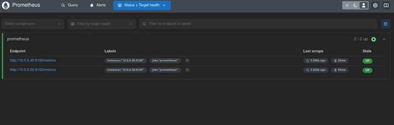

I've always wanted a home lab, so I made one to run services like Prometheus, Grafana, and more on K3s and Docker. I deployed these services using Helm and configured the operating system with Ansible. These services are running on two Beelink mini PCs using NixOS and Rocky Linux for the operating system layer.

## Core Features
My home lab provides the following functionality:
- Observability with system health and performance monitoring from **Prometheus** and dashboard visualization from **Grafana**
- Configuration management and automation using **Ansible**
- Containerized services orchestrated with the **K3s** flavor of Kubernetes
- Declarative containers deployment using **Helm** and **Docker Compose**
- Declarative operating system configuration with **NixOS**
- Version control system hosting local code repositories on **Forgejo**
- File storage server with **Nextcloud** and file synchronization with **Syncthing**
- Self-hosted application launcher using **Heimdall**

## Pain of the Manual
I love working on infrastructure deployment and operations. Before this project, I used to tinker with smaller labs using Linux servers like Proxmox and Ubuntu. I also love learning about new open-source, self-hosted services that could boost my productivity and expand my skill set.

This time, however, I had one new objective: to have a home lab that is fun to manage. There was a lot of pain with my past labs due to how my devices were configured manually. When something (inevitably) goes wrong, I often don't have the time to dig through the logs, trace each step, and figure out what happened. I'd rather reset everything to have the service be online again; prioritizing availability.

However, this preference came with a big cost because I'd have to configure everything by hand again. It was discouraging to retrace my steps and relearn how to apply the same settings over and over again. It also limited the scope of my home lab because the risk of having to reapply the same configurations increases the more I add new devices and experiment with new services.

So I came up with a plan: I'm going to **use as much X-as-code technology as I can** for this project. I wanted to use Kubernetes. I wanted to codify as much hands-on Linux configuration into Ansible as possible. I even went as far as planning to use NixOS, an experimental Linux distribution where *every* system configuration is in code. This goal became a major influence on how I chose the technology I used for this project.

## Technologies Used
**Observability tools**
- [Prometheus](https://prometheus.io/)
- [Grafana](https://grafana.com/)

**Deployment and configuration management tools**
- [Helm](https://helm.sh/)
- [Ansible](https://docs.ansible.com/ansible/latest/index.html)

**Containerization and orchestration**
- Kubernetes with [K3s](https://k3s.io/)
- [Docker Compose](https://docs.docker.com/compose/)

**Operating system layer**
- [NixOS](https://nixos.org/)
- [Rocky Linux](https://rockylinux.org/)

### Why I chose these technologies
This project got started when I found the [Beelink mini PCs](https://www.amazon.com/Beelink-Lake-N150-Upgraded-Computer-Business/dp/B0DP2SGVVY?crid=36HCIJKITJN2B&dib=eyJ2IjoiMSJ9.aVqwMZh9Fvu-6xw_P6_JgovLN5sln2oOcTSUjwQQiUTC_qiDysVZ3qucHMVfcgIp8Gqw6x697gJihPdfsCQvF2SwYgO2lFPD3oEzWczH2dkvy-vGkEjSyAvevFtczarBjSq05tzfvaCdIMcrV6oJJewATWlaPuPg4ptQxul5Eg60TnrntatfIKSFT9e1uMHLuIre8oIzYF9gwUG9YvZN9g.oC5r2_G7cWkC2fWlxWQ5ZL9gW1JFlEquuRhtDNZXPds&dib_tag=se&keywords=beelink+mini+pc&qid=1743207996&sprefix=beelink+mini+p%2Caps%2C422&sr=8-2) (not sponsored) while browsing Amazon. I've seen some people recommending these mini PCs due to their low power consumption, decent performance, and relatively cheap price ($139 at the time of writing). They would be the perfect bare-metal layer for my lab environment as I can buy and set up as many of them as I want without breaking the bank.

I chose to use Rocky Linux as the OS for my first machine, as it's a free version of Red Hat's RHEL, and I'm the most familiar with RHEL-based distributions from the time spent studying for the RHCSA certification. The second machine will run NixOS as a way for me to get started with learning the declarative approach to Linux server configuration. NixOS is one of the most declarative ways to run your infrastructure, so it's the perfect tool to make as much of my lab into code as possible.

The decision to use mini PCs as the host machines heavily affected the tool I chose for the container runtime and orchestration layer. As each machine has a decent, but limited performance, K3s is the only choice to run a Kubernetes cluster because it has a low resources requirement. I didn't consider using Helm with K3s at first, but I started using it midway through the project because it was getting too difficult to manage the Kubernetes manifests for my services.

However, I still wanted a few services to be running on Docker using Docker Compose. These services are essential for my day-to-day productivity, and I wanted to them be accessible even if K3s is down.

For transcribing manual Linux configuration into code, I turned to Ansible because it's compatible with both Rocky Linux and NixOS while having an easy-to-learn syntax. It also doesn't require an agent to be installed on each host, so I can provision new machines without setting up an OS imaging pipeline.

By the end of the project, I got interested in adding a monitoring stack to my lab from listening to The Pragmatic Engineer's podcast episode on [Observability with Charity Majors](https://newsletter.pragmaticengineer.com/p/observability-the-present-and-future). I wanted to take the simplest path to provide observability, so I chose the Prometheus + Grafana stack.

## Highlights

### Wi-Fi bridge networking
First, I started with the networking. I had an issue where there were no direct ethernet ports that could connect my home lab to the internet, so I set up a Wi-Fi extender as a bridge and used its ethernet output to create a nested network within my home. The traffic between the devices in the lab will be routed internally, while the internet-bound traffic will be forwarded over the Wi-Fi extender. View more details about this process in [my blog post](https://dev.to/patimapoochai/how-to-run-a-home-lab-without-an-ethernet-port-220j).

### Configuration management and automation
I then installed Rocky Linux on my first machine and forced myself to only use Ansible to manage the configuration of the first machine.

I wrote an Ansible playbook to set up the host to be managed by Ansible. Some of the tasks that I wrote into the playbook are: creating an SSH key pair, uploading the key to the host, and setting up privilege escalation for the Ansible user account. I also wrote a playbook to optimize the system's power consumption by using the `tuned` package to apply battery-saving settings to the system.

It took quite a while to write the playbooks to get the machine ready for running container services. However, it was worth the effort because if the machine breaks and needs a reset, I can just rerun the Ansible playbook again, and it will be up and running in no time. I don't have to do anything by hand as all of the configuration to prepare the system for running services is defined in the configuration management tool.

### Productivity and essential services
There were a few services that were essential for my productivity, so I used Docker Compose to deploy them. I wanted services like Forgejo, Nextcloud, and Syncthing to be available at all times even if K3s is unavailable. I particularly have the least tolerance for downtime with the Forgejo service, as it will be hosting Kubernetes manifests and Ansible playbooks that are required to deploy everything else in the future.

I wrote Ansible playbooks to automate the deployment of the Docker Compose services to the Rocky Linux host. Some configurations can't be set within the Docker Compose files, like adding firewall rules to the host to open the necessary ports for each service, so those settings are applied by the playbook. This extra automation layer makes the whole process declarative and written as code.

### Container orchestration
Ansible was also used to deploy K3s on the Rocky Linux host as the container orchestration layer. While the installation process for K3s is very simple (just running a shell script) the software required a few special firewall rules to classify the traffic originating from the container network as "trusted." Adding these rules only required a few commands, but I still worked them into a playbook. The time it took to run a few commands manually will add up fast when you have to set up multiple nodes in the future.

### Declarative containers
I didn't plan to use Helm initially. Helm wasn't included in the curriculum for CKA when I took it, so I assumed that it wasn't needed if you're doing SysOps work (like setting up a home lab infrastructure). I also thought that it would be difficult to learn and that the time saved from using this tool would be too small. However, it was getting more difficult to manage the ever-growing number of Kubernetes manifests, so I decided to pick up Helm. It turned out to be a simple tool to learn, and it made the deployment process faster by bundling all of the manifests into one package.

The first service I deployed with Helm was Heimdall, and it provides a central place to host the shortcuts to all of the self-hosted services in my lab.

### Metrics, monitoring, and visualization
Following the discovery of Helm, I wrote the service manifests for the Prometheus and Grafanna services in Helm and used Ansible to automate their deployment to my K3s cluster. I also wrote a playbook to deploy the Prometheus node exporter's binary, upload the configuration files, and open the firewall ports for metrics collection.

Using the data collected from the node exporter, I could visualize each system metric in a dashboard by connecting Grafana to the Prometheus server.

### Troubleshooting Prometheus
While working on deploying Prometheus, I ran into an `open /prometheus/queries.active: permission denied` issue. After a few days of troubleshooting, I found that Prometheus required specific permission to be set on the host directory if it's being bind-mounted to the container. I fixed this issue by adding a task to the Prometheus deployment playbook to change the owner of the host directory to the same user as the one in the container. View how I troubleshoot and fix this issue on [my blog post](https://dev.to/patimapoochai/how-to-fix-prometheus-open-prometheusqueriesactive-permission-denied-on-kubernetes-22gf).

I also applied this lesson when writing the Helm chart for Grafana by setting the host directory's owner to have the same UID as the one defined in Grafana's [Dockerfile](https://github.com/grafana/grafana/blob/28b142e9513f587c4be62801794a8609037adbe8/Dockerfile#L138).

### Declarative OS configuration
While I had most of the services that I wanted running on the Rocky Linux host, I also wanted to learn declarative Linux configuration, so I provisioned another Beelink mini PC with NixOS. With this OS, you don't need to install extra configuration management tools as the operating system is already declarative, allowing you to configure every system setting from a single code file.

I wrote the NixOS configuration files to do the following: configure the host to be managed by Ansible, install the K3s as an agent with a dynamic IP address resolution for the K3s server node, install the Prometheus exporter, and expose the exporter's metrics endpoint to other nodes. I then wrote an Ansible playbook to push these files to the NixOS host, test the configuration, and rebuild the operating system from the configuration.

Using NixOS was a huge time saver. I estimated that it took me about a week of spending time after work and weekends to set up Ansible management, K3s, and Prometheus exporter for the Rocky Linux host. With NixOS, it took about 3 hours to set up the same three configurations.

While learning how to set up the host for Ansible management, I had a hard time understanding how the NixOS sudoers file worked as the documentation was sparse. After taking a few days to learn how sudo is implemented in NixOS, I compiled my notes and published them as a guide on dev.to. View my guide [here](https://dev.to/patimapoochai/how-to-edit-the-sudoers-file-in-nixos-with-examples-4k34).

## Lessons Learned
### Reflecting on the tool choices
The Prometheus + Grafana stack is a good introduction to observability, and I want to dive deeper into this topic by replacing Prometheus with [OpenTelemetry](https://opentelemetry.io/) sometime in the future.

Choosing K3s and Helm (later on) was a great tooling choice. I love how K3s make the process of getting a Kubernetes cluster up and running very easy. Helm has also become an essential tool for deploying services with Kubernetes, and I'm hoping to learn how to deploy services using a Helm repository in the future.

Ansible was also a great tool for deploying and managing my servers, but I also wished it was better. The tool was a step above writing bash scripts by providing idempotency and a large library of ready-to-use modules. However, I can't easily undo the changes after they were applied. If I make a mistake in my code, I can't just delete the offending line and rerun the playbook like how you would fix the same mistake in a modern DevOps tool like [Terrafom](https://www.terraform.io/).

These issues, however, are non-existent on NixOS. The configuration files behaved like a modern cloud infrastructure tool, where rollback is as simple as removing a line and rebuilding the operating system. Ansible can be added to existing systems to manage them as code, but in NixOS, the system is *already* code. I'm looking towards learning [Nix flakes](https://nixos.wiki/wiki/flakes) in the future to make my configuration even more reproducible across any device.

## So, still going back to manual configuration?
Going forward, I'm going to double down on always turning manual configurations into code. It just makes everything about building a home lab painless and fun. Have a broken service? You can just re-run the Helm or Docker Compose deployment. The host machine is broken with no obvious solutions? Just wipe it and run the Anisble playbooks to rebuild your machine automatically without having to spend hours setting it up manually again.

As long as I have the code to rebuild my lab, I won't feel anxious for my setup even if you decide to toss my devices into the ocean. (I would be confused as to why you would do that, but not anxious).

Check the infrastructure code for this project on [GitHub](https://github.com/patimapoochai/declarative-homelab-project/tree/main).