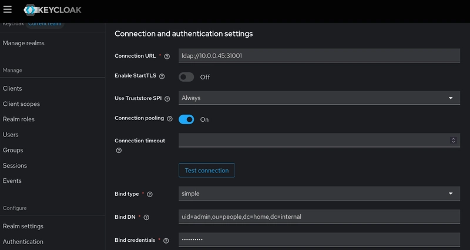

A growing problem with my home lab is password fatigue. Each time I add a new service to my network, I generate a new random password for it. I got by initially with using a different password for every service by storing them in a password manager, but as the number of services exceeded double digits, having to open my password manager every time I want to access each service is starting to hinder my productivity. I needed a self-hosted SSO solution for my home lab services, so I deployed an open-source IAM platform that supports SSO via OIDC, OAuth, and LDAP protocols to my Kubernetes cluster.

## Walkthrough
The initial design was simple. I only needed SSO for my services, namely Grafana and Syncthing, and my solution must support both modern protocols like OAuth/OIDC and legacy protocols like LDAP. I used [IBM's IAM architecture video](https://youtu.be/5uNifnVlBy4?si=C2xiKW8gnUEgNrNV) as an inspiration to draft a simple IAM stack using a modern identity management system that integrates with a single, centralized LDAP directory store.

The architecture of an IAM platform is made up of 3 layers: the base infrastructure layer, the application layer, and the connection layer. The base layer is composed of a directory store, a repository for identity information, and synchronization, the ability for multiple directories to share identity information with each other. There were many self-hosted LDAP directory servers available, like the [389 Directory Server](https://www.port389.org/) and [FreeIPA](https://www.freeipa.org/page/Main_Page), but I chose [LLDAP](https://github.com/lldap/lldap) to be the centralized directory store because of its simple configuration and low resource usage.

The application layer contains the software that implements IAM workflows like administration, access management, and roles. For this layer, I used [Keycloak](https://www.keycloak.org/) to provide the functionality of an SSO system, like a user login interface and SSO redirection. The connection layer deals with identity federation across multiple IAM platforms, but because the scope of my project is only to deploy an SSO provider to my home lab network, implementing this layer is unnecessary.

I started by setting up a directory store using an LLDAP server. LLDAP is a minimal LDAP server with very basic features, and it can only integrate with a limited range of LDAP services. I deployed the LLDAP server alongside a Keycloak instance using Helm and configured a read-only federation with Keycloak to synchronize the users in its directory with the users from the LLDAP directory. LLDAP also doesn't support modern authentication methods like OAuth and OIDC, so setting up federation allowed users within the LLDAP directory to authenticate with applications that don't support LDAP.

Federation also allowed me to manage identities across both tools in one centralized directory store, as changes in the LLDAP directory will also be reflected in Keycloak's directory. This configuration created the least management overhead while providing the widest compatibility for both legacy applications using LDAP and modern applications using OAuth and OIDC.

The IAM platform is pretty much complete, and now I only need to configure my applications to use the platform as the SSO provider. First, Grafana supports OAuth/OIDC authentication, so I set Grafana as a "client" of Keycloak and configured it to redirect any user sign-in requests to Keycloak's authentication page. After the user signs in with their Keycloak account, Grafana will receive the ID and access tokens from Keycloak that contain the user's identity information.

Other applications that don't support OAuth/OIDC authentication, like Syncthing, can use LLDAP as the SSO provider directly. It is less secure to configure SSO authentication with Syncthing, as LLDAP uses the admin account directly to query the identity information for each login.

## Final Thoughts
This project was a great introduction to the IAM architecture and its security protocols, and it will help me improve my future projects. There are certain side projects that are too small to use an enterprise IAM solution, while also being too big to not implement some form of user authentication. One project that comes to my mind is the [5D Diplomacy With Multiverse Time Travel](https://github.com/Oliveriver/5d-diplomacy-with-multiverse-time-travel) game. It's a web game that was released as a self-hosted project without user authentication initially, and it created a huge barrier to entry for non-technical players who'd rather have a public instance of the game where they can quickly try out the game.

Projects like this would have lowered the barrier to entry and gained a lot of visibility by having an IAM system, yet it's a huge pain to write your own authentication code. Learning how to use off-the-shelf IAM tools like Keycloak and LLDAP saves you a lot of time from having to reinvent the wheel while also using industry-standard protocols that enable you to migrate your projects to an enterprise IAM solution in the future.

View my project on [Github](https://github.com/patimapoochai/self-hosted-iam)