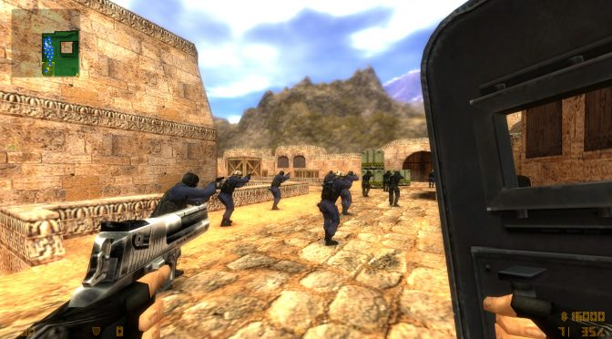
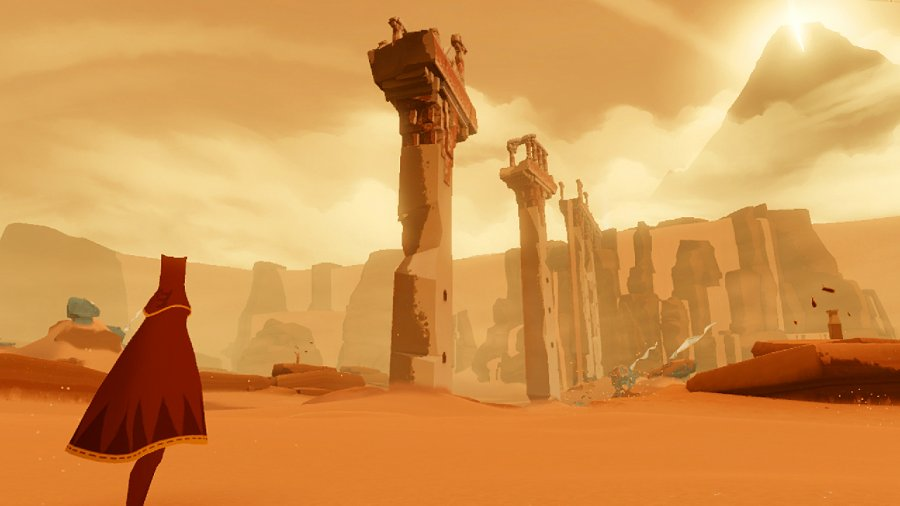

  

    
      
Pictured: Basically my childhood home
    

  

If someone were to ask what reason made me join the computer science program at the University of Hawaii, I wouldn't want to answer them. Like many of my peers, I came into the major because my interests in video games. I don't have a specific video game title that could be the sole cause for pushing my life in its current direction. instead, this interest spurs from the collection of titles released during the early 2000s. Seeing many game companies becoming successful and making a lot of money at the time also helped with choosing to enroll in U.H. as a Computer Science major. My game plan at the time was to get a computer science degree, then start working as a game designer at one of the popular companies, like Valve or Mojang.

Like all plans, my desired career path changed when I came into contact with the ICS program at U.H. at Manoa. At first, I was disinterested with the required introductory classes of the program. "Using Java and learning discrete math isn't necessary to becoming a game developer!," I thought. After pouting for sometime, I slowly began to saw how my classes, despite being unrelated, could help me to reach my desired career. Each computer science topics, like memory management and algorithms, provide a foundation of general programming that I could use in actual game programming.

The clubs organized by fellow CS students also help me develop my goal into a more practical career plan. By participating in a club like the Associate for Computing Machinery at Manoa, I was able to experience other possible career options. In my time at Grey Hats at Manoa, I was participate IT team that have to administrate and maintain a computer system against real attacker. Collaborating, screwing around, and failing spectacularly to secure a system is, surprisingly, more fun to me than working on a video game. Comparing being a system administrator to a game developer, working through stressful crunches and being exploited by game publishers wasn't as appealing.

After my experience of studying computer science in an academic setting, my new goal is to try as many things as possible. I would still work on game development, but now I'm more open to learning other topics, such as software engineering, web design, and machine learning. I've also joined other clubs, like the Programming and Algorithms club, and aiming to participate in competitions, like ICPC and Global Game Jam.

  

    
    

    I though I knew everything, but the peak is still far away.
    

  

