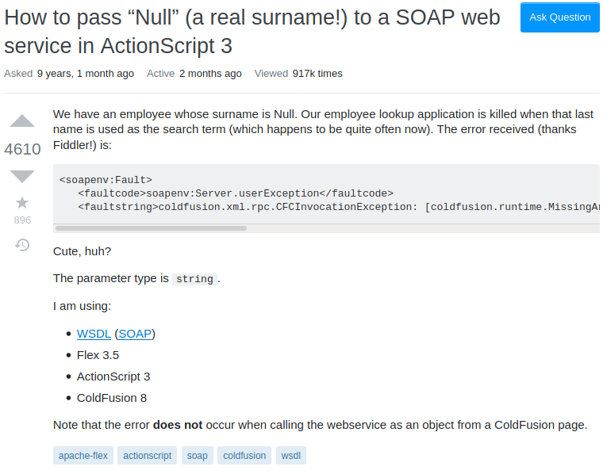

  

    
      

        The question looks so unappealing, you probably skipped down to the captions, didn't you?
    

  

### What do you mean, "have you researched first?"

  

    
      

      "The code, Mason! Where is the error?!" a Stack Overflow helper heard as he was forced to look at a huge code dump.
    

  

Stack Overflow is one of the largest (if not THE largest) popular online resources regarding topics related to computers. Never venturing into the side of answering questions myself, I often find most responses vague and unhelpful. Before learning how to ask questions smartly, a post like the one pictured above is something that you could see me posting. The content, in addition to being unfriendly to the reader's eyes, is only written to my benefit. Something like stating the section where the problem occurred wouldn't be considered since I already know the code. My older self would have forgone researching the documentation or experimenting, and I would expect the community to lists only the commands or lines of code I need to type in to fix the issue. The answers that accompany these questions similar to this one perplexes me. If I were to read responses to this question at the beginning of my coding career, I would only look in disdain the long explanation that requires me to understand the fixes to my problem. If this platform contains so many people to get their questions answered, then why do so many people prefer to not give short, explicit questions? What is the secret to getting responses that I'm missing?

### A Certain Paradigm Shift
Reading [How To Ask Questions The Smart Way](http://www.catb.org/esr/faqs/smart-questions.html) by Eric Raymond exposed a different side of questions asking that I haven't considered; that I'm not entitled to have my questions answered on public forums. Each person on Stack Overflow is dedicated, sure, but they are doing this on their own accord. For them to answer a question, it has to be worth their time. The very nature of questions asking requires the participation of two parties. The asker's initiative to post a clear, concise question, and the answerer's willingness to answer them. To paraphrase Raymond, the very act of asking, despite beginning with the goal of benefitting the asker, often also benefits the answer-er as well. "Hackers" loves to solve hard problems that are offered in a clear, thought-provoking question. To get my questions answered no longer becomes a problem of whether a large number of people would be knowledgeable enough to answer my question, but rather to match the attitude of a "hacker."

### The Correct Attitude of a Question

  

    
      
A pro "strat" to bring the hackers to the yard.
    

  

Computer scientists are certainly the biggest bunch of eccentric people I've met, but this eccentricity could also save your life. Raymond's work inspired me not to look at my questions as a means of completing my own goal. In this example question from Stack Overflow, the most important aspect of the question isn't that it has the largest amount of people that know about the necessary topic. Rather, it should appeal to the innate instinct of all programmers to solve problems. While not stated in Eric's article, I believe that the key to getting answers is to present your questions with many characteristics similar to interview questions. The description of the problem should be precise, but contains details that have been thoroughly researched. The environment that which the problem resides is listed clearly, in a short bullet point. Lastly, the problem is presented with a clear, short description. The main job of a programmer is to break down and solves problems, so allowing them to focus on solving the problem, rather than getting bogged down on trying to understand the problem itself, would allow one to better get the help they need.
