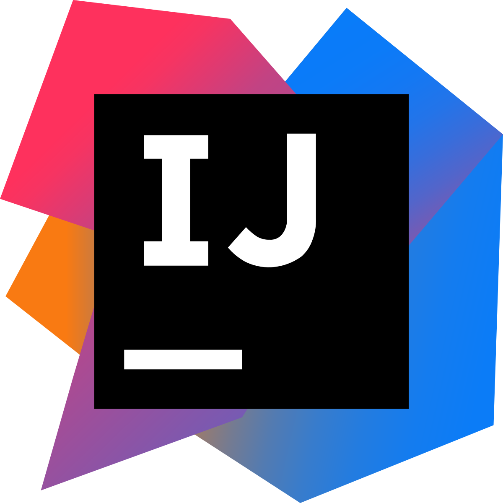

  

    
      

        Coming from Atom, IntelliJ feels restrictive.
    

  

### Limitless Possibility
One of the best characteristics of programming is its accessibility, where anyone can create their coding style. Each programmer is different in their ability and comfort, and each individual could develop a process of writing code that is the most efficient for them. One of my examples of this is within the IntelliJ editor's options for using a terminal. An external terminal emulator of a Linux machine could be used to install add-ons like npm, but the IDE also offers its terminal for anyone who prefers Windows. In this discipline, it’s very difficult to not find several alternatives to your workflow. However, this characteristic is also a curse, since people brought with them different ways of writing code. To correct and make code easier to read, the dreaded coding standards would have to dampen this benefit of programming.

### Limitation of Potential
Perhaps it's because of software engineering's freedom of learning, where you can utilize multiple resources online, that people dislike limiting programming into one way. Before my exposure to coding standards, programming seems to requires fewer restrictions and formatting rules than other forms of technical writing. Research papers, with their templates, page formatting, and citations, is very different from the almost-free-flow statements and brackets placements. One could spread one expression over multiple lines or reduce an if statement into one line and the compiler would still process the code. This possibility of writing code in any desired format would be limited by coding standards.  As a student, I could see the dissimilarity between free-form learning and the strict programming rules being disorientating for some.

### Exceeding the Limits
When I got past the learning curve, however, the limiting coding standard began to show its potential. My code and its structure became more readable and friendlier towards searching and debugging. Applying this observation towards the bigger picture, coding standards allow for unified formatting for all coders, so everyone now has the same coding style. This is a huge time saver for collaborative coding, taking the time away from trying to understand the code and push it towards actual programming. Coding standards are limiting for individuals, but it allows for easier cooperation and sharing of code. A coding standard becomes a necessary “evil” to maintain the best characteristic of programming. Anyone could approach programming in whichever way that is suitable to them, but that wouldn’t be true accessibility if each person’s code can’t be understood by everyone.

  

    
    

        Code that don't follow the coding standard could look very confusing from the outside.
    

  

