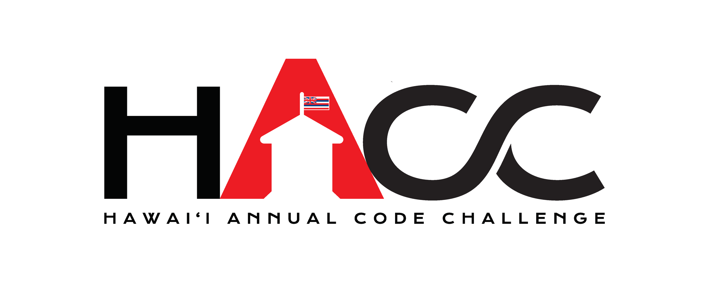

  

The [Hawaii Annual Code Challenge](https://hacc.hawaii.gov/) is a hackathon event hosted in Honolulu. The aim of the event was to inspire innovation within the state of Hawaii and allowing local developers, engineers, and students to create new solutions to problems within the state. Participants, ranging from high school students to professional developers, are given issues faced by the Hawaiian government or local businesses. Within the span of a month, each team must develop a solution and present it to a panel of judges, including the governor of Hawaii, David Ige.

  

Governor David Ige aims to push for sustainability development within Hawaii, and the challenge that my team has chosen include a theme of spreading awareness for sustainability. We chose to work on the Department of Education's curriculum database solution, using [Django](https://www.djangoproject.com/), [ArcGIS](https://www.esri.com/en-us/arcgis/about-arcgis/overview) and [Firebase](https://firebase.google.com/). The web application would list all of the sustainable projects from Hawaii, allowing local educators to receive funding or recognition for their projects. The infrastructure splits into two parts, the front-end website that interacts with the back-end curriculum database. My role in the team was front-end and U.I. designer, making mockups for the former portion of this project. We created dynamic web pages that list all the sustainable projects, along with each project's sweat equity, funding needed, and recommended grade level. Teachers, students, and local businesses could use our application to search and browse for local, sustainable curriculums that they could contribute to; establishing connections between projects and the resources they need. I've also made the logo for the application, which was used as the branding for the project.

  

This project was my introduction to the web development cycle. I've learned about the division of front-end, back-end, and database roles, the process to make a web application, and the different tools required. I also worked with some of my upperclassmen at the University of Hawaii at Manoa, and I was able to get a head start in learning some of the tools used in my upcoming web-development class. In the next HACC, I want to learn more about back-end development and furthering my familiarity with U.I. design.

The project is posted on the [DEVPOST Website](https://devpost.com/software/galaxy-brains),
Source: <a href="https://github.com/HACC2019/galaxy-brains"><i class="large github icon "></i> HACC2019/galaxy-brains</a>
