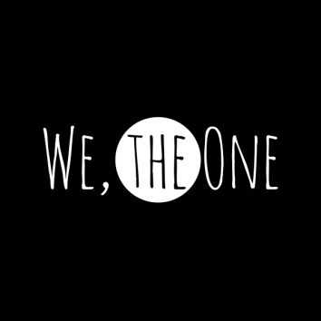
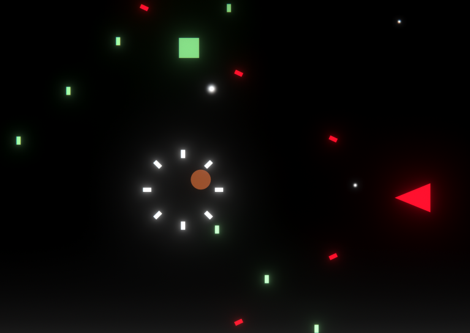
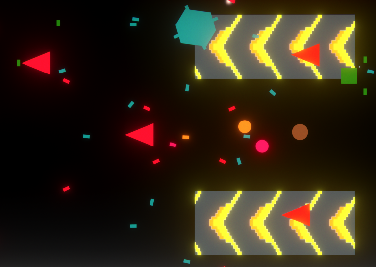

At the beginning of the spring semester, I've participated in the [Global Game Jam](https://globalgamejam.org/). This is an international event where game developers across the world create games within a time limit of 3 days. The theme for this year was "Home," and we are encouraged to create a game that fits within the theme. As a bonus, we've also chosen to make the game using primitives shapes.

The idea started from how friends could make one's life better. At the beginning of the game, the player starts alone and weak. Enemies are able to shoot the player from afar, and they could only be killed by getting very close. As the main character moves to the right, they are able to gain "friend" orbs that would circle around and shoot the enemies. The adaptive music and post-processing would also transition into a more colorful tone to reflect this progression. When the player reaches the end, the orbs that they have collected would show up in the main menu. This change would encourage people to replay the game again to collect every "friend" orbs.

The game was build with the [Unity](https://unity.com/) game engine, [Blender](https://www.blender.org/) 3D editor, and [FMOD](https://www.fmod.com/) adaptive sound system. My main contribution towards the project is through programming. While I wasn't familiar with the engine, I was able to collaborate with my teammates to prototype and program the enemies. The time pressure has allowed me to learn a lot about Unity, and I've learned to quickly turn an idea into a prototype.

  
  

The submission is hosted at the [Global Game Jam page](https://globalgamejam.org/2019/games/we-one).
